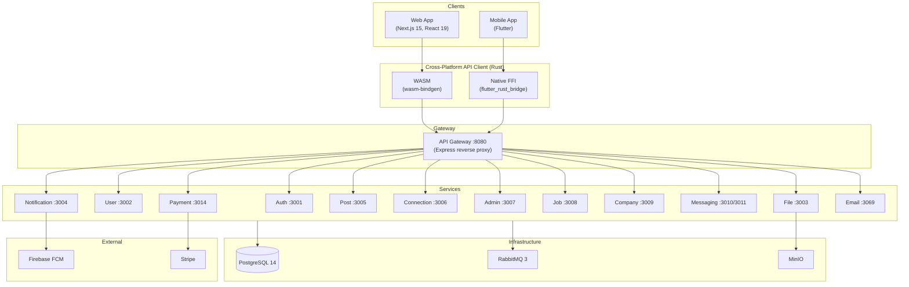
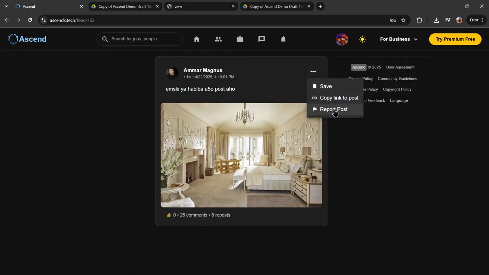

<p align="center">
  
</p>

<p align="center">Full-stack LinkedIn clone: feed, messaging, jobs, connections, notifications, payments.<br>14 Node.js/TypeScript microservices, Next.js web app, Flutter mobile client, and a cross-platform Rust API client.</p>

## Demo

[Video demos](https://drive.google.com/drive/folders/1vEfGCfwK6KJzNLfpZg3mCTFyX-7c4hP2)

## Architecture



All services share a single PostgreSQL database using a **schema-per-service** pattern (e.g., `auth_service.users`, `post_service.posts`). Services communicate through RabbitMQ using two patterns:

- **Events** (fire-and-forget): a topic exchange (`system.events`) routes events like `USER_CREATED`, `FILE_DELETE`, and `NOTIFICATION_SEND` to interested consumers.
- **RPC** (request-response): services expose named queues for synchronous calls. For example, the Post service calls `file.file_url_rpc.queue` to get presigned URLs, or `user.profile_rpc.queue` to resolve user profiles.

## Tech Stack

| Layer | Technology |
|-------|------------|
| Web | Next.js 15, React 19, MUI 6, Zustand, Axios, Socket.IO |
| Mobile | Flutter 3.7+, BLoC, Dio, Hive, GetX |
| API Client | Rust, reqwest, wasm-bindgen (web), flutter_rust_bridge (mobile) |
| Backend | Node.js 18, Express 4, TypeScript 5 |
| Database | PostgreSQL 14 (raw SQL, schema-per-service) |
| Messaging | RabbitMQ 3 (topic exchange, pub/sub + RPC) |
| Object Storage | MinIO (S3-compatible, presigned URLs) |
| Auth | JWT (30-day tokens), bcrypt, Google OAuth via Firebase |
| Payments | Stripe Checkout (one-time + subscriptions, webhooks) |
| Push Notifications | Firebase Cloud Messaging (via firebase-admin) |
| Real-time | Socket.IO (WebSocket server on :3011) |
| CI/CD | GitHub Actions, Docker Compose, VM deploy via SSH |

## Services

| Service | Port | What it does |
|---------|------|-------------|
| **Auth** | 3001 | Registration with email verification, login, Google OAuth, password reset (link or 6-digit code), ban system with expiry, admin user seeding |
| **User** | 3002 | Full profile CRUD (education, experience, projects, courses, skills, interests), profile/cover photo and resume uploads via File service RPC |
| **Post** | 3005 | Posts with media (images, video, documents), reactions, nested comments, reposts, saves, user tagging, content search, privacy levels, engagement counters |
| **Connection** | 3006 | Connection requests, follow/unfollow, blocking, message requests, mutual connections, 2nd-degree network, per-user privacy preferences |
| **Messaging** | 3010 | Conversations with file attachments, WebSocket server on :3011 for typing indicators, read receipts, online presence, multi-device support |
| **Notification** | 3004 | In-app notifications with pagination, push via FCM, auto-enriches payloads with user profiles via RPC |
| **Job** | 3008 | Job postings linked to companies, search, applications with resume upload, application status tracking, saved jobs |
| **Company** | 3009 | Company pages with profile/cover photos, announcements, follower system, company search, analytics |
| **Payment** | 3014 | Stripe Checkout for one-time purchases and recurring subscriptions, usage metering (messages/day, connections, job apps/month), webhook handling |
| **File** | 3003 | Upload to MinIO, presigned URL generation, file metadata. Exposes RPC queues so other services can upload files (base64 over RabbitMQ, up to 5MB) |
| **Email** | 3069 | Internal email storage and delivery, consumed via `EMAIL_SEND` events from other services |
| **Admin** | 3007 | Dashboard with counts across all schemas, reported content management, content moderation (delete posts/jobs), user management |
| **Gateway** | 8080 | Express reverse proxy routing by path prefix. Passes multipart uploads through without parsing (via `x-no-parse-body` header) |

## Project Structure

```
ascend/
  apps/
    web/                             # Next.js web app
    mobile/                          # Flutter mobile app
  services/
    gateway/                         # API gateway (reverse proxy)
    auth/                            # Authentication, OAuth
    user/                            # Profiles, resume, settings
    post/                            # Feed, comments, reactions
    messaging/                       # Chat (HTTP + WebSocket)
    connection/                      # Connections, follows, blocking
    notification/                    # Push and in-app notifications
    job/                             # Job posts, applications
    company/                         # Company pages, announcements
    payment/                         # Stripe subscriptions, usage limits
    file/                            # File uploads (MinIO)
    email/                           # Email delivery
    admin/                           # Admin dashboard, moderation
    gateway-reverse-proxy/           # External traffic forwarding
  packages/
    shared/                          # Backend SDK (DB pool, auth middleware, RabbitMQ, models)
    api-client/                      # Rust client (compiles to WASM for web, native FFI for mobile)
  scripts/                           # Deploy, backup, restore scripts
  docker-compose.yml                 # Production
  docker-compose.dev.yml             # Dev (hot reload, pgAdmin, exposed ports)
  docker-compose.reverse-proxy.yml   # Reverse proxy to gateway
```

## Quick Start

**Prerequisites:** Docker and Docker Compose.

```bash
git clone https://github.com/MRKDaGods/ascend.git
cd ascend
cp .env.example .env
# Fill in your credentials (Stripe keys, Firebase service account, Google OAuth client IDs)
docker compose up
```

Gateway available at `http://localhost:8080`.

For development with hot reload and pgAdmin:

```bash
docker compose -f docker-compose.yml -f docker-compose.dev.yml up
```

pgAdmin at `http://localhost:5050`. Each service port is listed in the table above.

### Web app

```bash
cd apps/web
cp .env.example .env.local
# Fill in NEXT_PUBLIC_FIREBASE_* values
npm install
npm run dev
```

### Mobile app

```bash
cd apps/mobile
cp lib/firebase_options.dart.example lib/firebase_options.dart
cp android/app/google-services.json.example android/app/google-services.json
# Fill in your Firebase config values
flutter pub get
flutter run
```

## Documentation

| Area | Guide |
|------|-------|
| Backend Services | [services/README.md](services/README.md) |
| Web App | [apps/web/README.md](apps/web/README.md) |
| Mobile App | [apps/mobile/README.md](apps/mobile/README.md) |
| API Client (Rust) | [packages/api-client/README.md](packages/api-client/README.md) |
| Shared Backend SDK | [packages/shared/README.md](packages/shared/README.md) |
| Scripts | [scripts/README.md](scripts/README.md) |

## Team

Built by students at Cairo University, Faculty of Engineering.

### Backend

| Name | GitHub | Area |
|------|--------|------|
| Mohamed Ammar | [@MRKDaGods](https://github.com/MRKDaGods) | Project lead, auth, email, notifications, user, most backend services, shared SDK, API client (Rust), infra, contributions across all layers |
| Ali Ashraf | [@3li-Ashraf](https://github.com/3li-Ashraf) | Jobs, messaging, admin |
| Bassem Adam | [@BassemAdam](https://github.com/BassemAdam) | Posts, connections |
| Mohamed Ayman | [@mohamed-ayman-28](https://github.com/mohamed-ayman-28) | Company, payments |

### Web

| Name | GitHub | Area |
|------|--------|------|
| Habiba Hammouda | [@HabibaHammouda](https://github.com/HabibaHammouda) | Feed, network, components |
| Hana Ahmed | [@Hana-Ahmed2](https://github.com/Hana-Ahmed2) | Jobs, search, notifications |
| Nouran Haridy | [@nouranharidy](https://github.com/nouranharidy) | Profile, premium |
| Ruaa Tolba | [@rtolba04](https://github.com/rtolba04) | Chat, admin dashboard |
| Mehrati Sameh | [@Mehrati3](https://github.com/Mehrati3) | Company, auth |

### Mobile

| Name | GitHub | Area |
|------|--------|------|
| Seif Heakal | [@seifheakal](https://github.com/seifheakal) | Feed, posts, profile |
| Mohammed Ibrahim | [@M7mdddibrahim](https://github.com/M7mdddibrahim) | Admin panel, routing, auth |
| Mohamed Tarek Afifi | [@Motarek2003](https://github.com/Motarek2003) | Messaging, networks, settings |
| Maged Wadi | [@MagedWadi](https://github.com/MagedWadi) | User profile, company |
| Mostafa Osama | [@zcrack4i0](https://github.com/zcrack4i0) | Jobs |

### DevOps

| Name | GitHub | Area |
|------|--------|------|
| Abdelrahman Hamdi | [@gumfreddy](https://github.com/gumfreddy) | CI/CD, Docker, deployment |

### QA

| Name | GitHub | Area |
|------|--------|------|
| Shehab Elhadary | [@shehab400](https://github.com/shehab400) | Selenium E2E tests |
| Hamza Ahmed | [@Hamzaahmeed](https://github.com/Hamzaahmeed) | Cypress E2E tests |

## Bonus



## License

MIT
