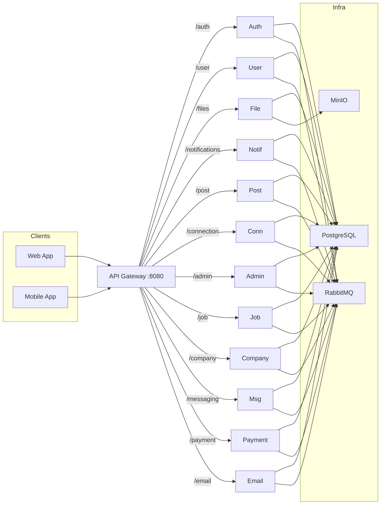

# Backend Services

14 Express/TypeScript microservices behind an HTTP API gateway. Services communicate asynchronously through RabbitMQ (pub/sub events and RPC calls). All services share a single PostgreSQL instance with logical schema separation per service. No ORM; all queries are raw SQL via the `pg` driver.

The shared backend SDK (`@ascend/shared`) provides database connections, JWT middleware, RabbitMQ helpers, and TypeScript models. See [packages/shared/README.md](../packages/shared/README.md).

## Architecture



## Services

| Service | Port | Path | Description |
|---------|------|------|-------------|
| gateway | 8080 | / | HTTP reverse proxy, routes requests to downstream services |
| auth | 3001 | /auth | Registration, login, Google OAuth, email verification, password reset |
| user | 3002 | /user | Profile CRUD, avatar and cover photo uploads, resume |
| file | 3003 | /files | File uploads and downloads backed by MinIO |
| notification | 3004 | /notifications | Push (Firebase) and in-app notifications, event-driven via RabbitMQ |
| post | 3005 | /post | Posts, comments, likes, reposts, media uploads |
| connection | 3006 | /connection | Connection requests, follows, blocking |
| admin | 3007 | /admin | User management, banning, reports |
| job | 3008 | /job | Job listings, search, applications |
| company | 3009 | /company | Company pages, analytics, announcements |
| messaging | 3010/3011 | /messaging | Real-time chat (HTTP + WebSocket via Socket.IO) |
| payment | 3014 | /payment | Stripe subscriptions, usage metering, webhooks |
| email | 3069 | /email | Transactional email sending |
| gateway-reverse-proxy | 23469 | / | Standalone reverse proxy to the gateway |

## Code Structure

Every service follows the same directory layout:

```
src/
  routes/         # Express Router definitions
  controllers/    # Request handlers
  services/       # Business logic and SQL queries
  consumers/      # RabbitMQ event consumers (optional)
  producers/      # RabbitMQ event producers (optional)
  validations/    # Input validation (optional)
  index.ts        # Entry point, calls startSharedService()
```

## Shared Patterns

### Service Bootstrap

Every service calls `startSharedService()` from `@ascend/shared`. This function:
1. Creates an Express app with CORS and JSON body parsing
2. Mounts the service's routes
3. Connects to RabbitMQ and registers consumers
4. Starts listening on `process.env.PORT`

### Database

Single PostgreSQL 14 instance. Each service uses its own schema (e.g., `auth_service.users`, `post_service.posts`, `messaging_service.conversations`). Connection pool is shared via `@ascend/shared/config/db.ts`. All queries use parameterized placeholders (`$1`, `$2`, etc.).

No migration tool. Schema changes are applied manually.

### RabbitMQ

Services communicate through a topic exchange (`system.events`). Two patterns:
- **Pub/sub**: `publishEvent()` fires events consumed by multiple services (e.g., user registration triggers a welcome email and a notification)
- **RPC**: `callRPC()` sends a request to a specific service and waits for a reply with correlation IDs and timeouts

Events and payload types are defined in `@ascend/shared/rabbitMQ/`.

### Auth Middleware

JWT validation middleware from `@ascend/shared`. The gateway does not validate tokens; each downstream service applies the middleware on protected routes. Tokens carry user ID and role.

## Running a Single Service

For local debugging outside Docker:

```bash
# Make sure PostgreSQL, RabbitMQ, and MinIO are running (via Docker or locally)
cd services/auth
npm install
npm run dev   # Uses nodemon for hot reload
```

Environment variables are read from the root `.env` file.

## Adding a New Service

1. Create a new directory under `services/`
2. Copy the `Dockerfile` pattern from an existing service
3. Add the service to `docker-compose.yml` and `docker-compose.dev.yml`
4. Add a proxy route in `services/gateway/src/index.ts`
5. Add the service name to the `Services` enum in `packages/shared/src/index.ts`
